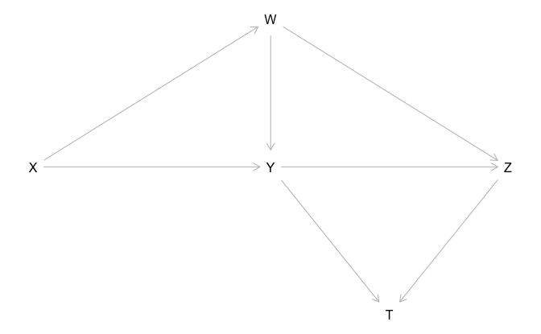
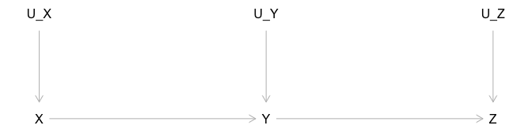
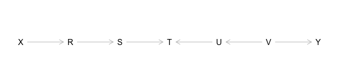
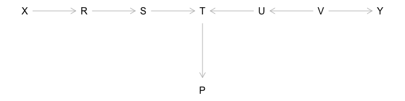
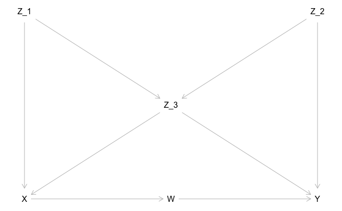
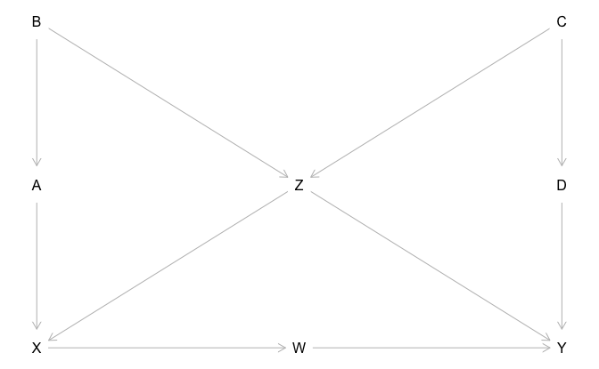
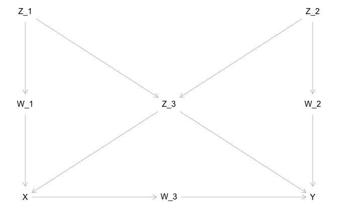

Causal Inference in Statistics: A Primer
================
Bill Behrman
2023-06-13

- <a href="#preliminaries-statistical-and-causal-models"
  id="toc-preliminaries-statistical-and-causal-models">1 Preliminaries:
  Statistical and Causal Models</a>
  - <a href="#graphs" id="toc-graphs">1.4 Graphs</a>
    - <a href="#study-question-1.4.1" id="toc-study-question-1.4.1">Study
      question 1.4.1</a>
    - <a href="#study-question-1.5.1" id="toc-study-question-1.5.1">Study
      question 1.5.1</a>
- <a href="#graphical-models-and-their-applications"
  id="toc-graphical-models-and-their-applications">2 Graphical Models and
  Their Applications</a>
  - <a href="#colliders" id="toc-colliders">2.3 Colliders</a>
    - <a href="#study-question-2.3.1" id="toc-study-question-2.3.1">Study
      question 2.3.1</a>
  - <a href="#d-separation" id="toc-d-separation">2.4 d-separation</a>
    - <a href="#study-question-2.4.1" id="toc-study-question-2.4.1">Study
      question 2.4.1</a>
  - <a href="#model-testing-and-causal-search"
    id="toc-model-testing-and-causal-search">2.5 Model Testing and Causal
    Search</a>
    - <a href="#study-question-2.5.1" id="toc-study-question-2.5.1">Study
      question 2.5.1</a>
- <a href="#the-effects-of-interventions"
  id="toc-the-effects-of-interventions">3 The Effects of Interventions</a>
  - <a href="#the-backdoor-criterion" id="toc-the-backdoor-criterion">3.3
    The Backdoor Criterion</a>
    - <a href="#study-question-3.3.1" id="toc-study-question-3.3.1">Study
      question 3.3.1</a>
  - <a href="#conditional-interventions-and-covariate-specific-effects"
    id="toc-conditional-interventions-and-covariate-specific-effects">3.5
    Conditional Interventions and Covariate-Specific Effects</a>
    - <a href="#study-question-3.5.1" id="toc-study-question-3.5.1">Study
      question 3.5.1</a>
  - <a href="#causal-inference-in-linear-systems"
    id="toc-causal-inference-in-linear-systems">3.8 Causal Inference in
    Linear Systems</a>
    - <a href="#study-question-3.8.1" id="toc-study-question-3.8.1">Study
      question 3.8.1</a>

The following are solutions using the
[dagitty](https://cran.r-project.org/web/packages/dagitty/index.html) R
package to study questions from the book

J Pearl, M Glymour, NP Jewell. Causal Inference in Statistics: A Primer.
Wiley, 2016.

The [book’s website](http://bayes.cs.ucla.edu/PRIMER/) contains PDFs for
each chapter.

``` r
# Packages
library(tidyverse)
library(dagitty)
```

The code below uses dagitty version 0.3-2. If the CRAN version is less
than 0.3-2, you can install the current development version with:

``` r
remotes::install_github("jtextor/dagitty/r")
```

## 1 Preliminaries: Statistical and Causal Models

### 1.4 Graphs

Figure 1.8. A directed graph used in study question 1.4.1.

``` r
fig_1.8 <- 
  dagitty(
    'dag {
      T [pos = "1.5, 2"]
      W [pos = "1, 0"]
      X [pos = "0, 1"]
      Y [pos = "1, 1"]
      Z [pos = "2, 1"]
      
      W -> {Y Z}
      X -> {W Y}
      Y -> {T Z}
      Z -> T
    }'
  )

plot(fig_1.8)
```



#### Study question 1.4.1

Consider the graph shown in Figure 1.8:

(a) Name all of the parents of Z.

``` r
parents(fig_1.8, "Z")
```

    #> [1] "W" "Y"

(b) Name all the ancestors of Z.

``` r
ancestors(fig_1.8, "Z", proper = TRUE)
```

    #> [1] "Y" "X" "W"

(c) Name all the children of W.

``` r
children(fig_1.8, "W")
```

    #> [1] "Y" "Z"

(d) Name all the descendants of W.

``` r
descendants(fig_1.8, "W", proper = TRUE)
```

    #> [1] "Z" "T" "Y"

(e) Draw all (simple) paths between X and T (i.e., no node should appear
more than once).

``` r
print_paths <- function(graph, from, to, ...) {
  paths(graph, from = from, to = to, ...) |> 
    pluck("paths") |>
    cat(sep = "\n")
}
```

``` r
print_paths(fig_1.8, from = "X", to = "T")
```

    #> X -> W -> Y -> T
    #> X -> W -> Y -> Z -> T
    #> X -> W -> Z -> T
    #> X -> W -> Z <- Y -> T
    #> X -> Y -> T
    #> X -> Y -> Z -> T
    #> X -> Y <- W -> Z -> T

(f) Draw all the directed paths between X and T.

``` r
print_paths(fig_1.8, from = "X", to = "T", directed = TRUE)
```

    #> X -> W -> Y -> T
    #> X -> W -> Y -> Z -> T
    #> X -> W -> Z -> T
    #> X -> Y -> T
    #> X -> Y -> Z -> T

#### Study question 1.5.1

(a) Draw the graph that complies with the model.

``` r
graph <- 
  dagitty(
    'dag {
      U_X [pos = "0, 0"]
      U_Y [pos = "1, 0"]
      U_Z [pos = "2, 0"]
      X [pos = "0, 1"]
      Y [pos = "1, 1"]
      Z [pos = "2, 1"]
      
      U_X -> X
      U_Y -> Y
      U_Z -> Z
      X -> Y
      Y -> Z
    }'
 )

plot(graph)
```



## 2 Graphical Models and Their Applications

### 2.3 Colliders

Figure 2.5. A directed graph for demonstrating conditional independence
(error terms are not shown explicitly).

``` r
fig_2.5 <- 
  dagitty(
    'dag{
      X [pos = "0, 0"]
      R [pos = "1, 0"]
      S [pos = "2, 0"]
      T [pos = "3, 0"]
      U [pos = "4, 0"]
      V [pos = "5, 0"]
      Y [pos = "6, 0"]
      
      X -> R -> S -> T <- U <- V -> Y
    }'
  )

plot(fig_2.5)
```



Figure 2.6. A directed graph in which P is a descendant of a collider.

``` r
fig_2.6 <- 
  dagitty(
    'dag{
      X [pos = "0, 0"]
      R [pos = "1, 0"]
      S [pos = "2, 0"]
      T [pos = "3, 0"]
      U [pos = "4, 0"]
      V [pos = "5, 0"]
      Y [pos = "6, 0"]
      P [pos = "3, 1"]
      
      X -> R -> S -> T <- U <- V -> Y
      T -> P
    }'
  )

plot(fig_2.6)
```



#### Study question 2.3.1

(a) List all pairs of variables in Figure 2.5 that are independent
conditional on the set Z = {R, V}.

``` r
pairs <- function(v) {
  expand_grid(x = v, y = v) |> 
    filter(x < y)
}

print_independent <- function(graph, x, y, z = list()) {
  if (dseparated(graph, X = x, Y = y, Z = z))
    cat(str_glue("{x} \u27c2 {y} | {str_c(sort(z), collapse = ', ')}\n\n"))
}
```

``` r
z <- c("R", "V")

pairs(setdiff(names(fig_2.5), z)) |> 
  pwalk(print_independent, graph = fig_2.5, z = z)
```

    #> S ⟂ U | R, V
    #> S ⟂ X | R, V
    #> S ⟂ Y | R, V
    #> T ⟂ X | R, V
    #> T ⟂ Y | R, V
    #> U ⟂ X | R, V
    #> U ⟂ Y | R, V
    #> X ⟂ Y | R, V

(b) For each pair of nonadjacent variables in Figure 2.5, give a set of
variables that, when conditioned on, renders that pair independent.

``` r
print_implied_conditional_independencies <- function(graph, ...) {
  impliedConditionalIndependencies(graph, ...) |> 
    map_chr(\(x) str_replace(as.character(x), fixed("_||_"), "\u27c2")) |>
    cat(sep = "\n")
}
```

``` r
print_implied_conditional_independencies(fig_2.5)
```

    #> R ⟂ T | S
    #> R ⟂ U
    #> R ⟂ V
    #> R ⟂ Y
    #> S ⟂ U
    #> S ⟂ V
    #> S ⟂ X | R
    #> S ⟂ Y
    #> T ⟂ V | U
    #> T ⟂ X | R
    #> T ⟂ X | S
    #> T ⟂ Y | V
    #> T ⟂ Y | U
    #> U ⟂ X
    #> U ⟂ Y | V
    #> V ⟂ X
    #> X ⟂ Y

(c) List all pairs of variables in Figure 2.6 that are independent
conditional on the set Z = {R, P}.

``` r
z <- c("P", "R")

pairs(setdiff(names(fig_2.6), z)) |> 
  pwalk(print_independent, graph = fig_2.6, z = z)
```

    #> S ⟂ X | P, R
    #> T ⟂ X | P, R
    #> U ⟂ X | P, R
    #> V ⟂ X | P, R
    #> X ⟂ Y | P, R

(d) For each pair of nonadjacent variables in Figure 2.6, give a set of
variables that, when conditioned on, renders that pair independent.

``` r
print_implied_conditional_independencies(fig_2.6)
```

    #> P ⟂ R | S
    #> P ⟂ R | T
    #> P ⟂ S | T
    #> P ⟂ U | T
    #> P ⟂ V | U
    #> P ⟂ V | T
    #> P ⟂ X | R
    #> P ⟂ X | S
    #> P ⟂ X | T
    #> P ⟂ Y | V
    #> P ⟂ Y | U
    #> P ⟂ Y | T
    #> R ⟂ T | S
    #> R ⟂ U
    #> R ⟂ V
    #> R ⟂ Y
    #> S ⟂ U
    #> S ⟂ V
    #> S ⟂ X | R
    #> S ⟂ Y
    #> T ⟂ V | U
    #> T ⟂ X | R
    #> T ⟂ X | S
    #> T ⟂ Y | V
    #> T ⟂ Y | U
    #> U ⟂ X
    #> U ⟂ Y | V
    #> V ⟂ X
    #> X ⟂ Y

(e) Suppose we generate data by the model described in Figure 2.5, and
we fit them with the linear equation

Y = a + b \* X + c \* Z .

Which of the variables in the model may be chosen for Z so as to
guarantee that the slope b would be equal to zero? \[Hint: Recall, a
non-zero slope implies that X and Y are dependent given Z.\]

``` r
nodes <- list(list(), "R", "S", "T", "U", "V")

for (z in nodes)
  if (dseparated(fig_2.5, X = "X", Y = "Y", Z = z))
    cat(ifelse(is_empty(z), "list()", z), "\n")
```

    #> list() 
    #> R 
    #> S 
    #> U 
    #> V

X and Y are marginally independent, so the Z term could be omitted. X
and Y are conditionally independent when Z is any member of the set {R,
S, U, V}.

(f) Suppose we generate data by the model described in Figure 2.6, and
we fit them with the linear equation

Y = a + b \* X + c \* R + d \* S + e \* T + f \* P .

Which of the coefficients would be zero?

The coefficients for the following variables.

``` r
nodes <- c("P", "R", "S", "T", "X")

for (x in nodes)
  if (dseparated(fig_2.6, X = x, Y = "Y", Z = setdiff(nodes, x)))
    cat(x, "\n")
```

    #> P 
    #> R 
    #> X

### 2.4 d-separation

Figure 2.9. A causal graph used in study question 2.4.1. All error terms
(not shown) are assumed to be mutually independent.

``` r
fig_2.9 <- 
  dagitty(
    'dag{
      W [pos = "1, 2"]
      X [pos = "0, 2"]
      Y [pos = "2, 2"]
      Z_1 [pos = "0, 0"]
      Z_2 [pos = "2, 0"]
      Z_3 [pos = "1, 1"]
      
      W -> Y
      X -> W
      Z_1 -> {X Z_3}
      Z_2 -> {Y Z_3}
      Z_3 -> {X Y}
    }'
  )

plot(fig_2.9)
```



#### Study question 2.4.1

(a) For each pair of nonadjacent nodes in this graph, find a set of
variables that d-separates that pair. What does this list tell us about
independencies in the data?

``` r
print_implied_conditional_independencies(fig_2.9)
```

    #> W ⟂ Z_1 | X
    #> W ⟂ Z_2 | Z_1, Z_3
    #> W ⟂ Z_2 | X
    #> W ⟂ Z_3 | X
    #> X ⟂ Y | W, Z_2, Z_3
    #> X ⟂ Y | W, Z_1, Z_3
    #> X ⟂ Z_2 | Z_1, Z_3
    #> Y ⟂ Z_1 | X, Z_2, Z_3
    #> Y ⟂ Z_1 | W, Z_2, Z_3
    #> Z_1 ⟂ Z_2

For the data to be consistent with the causal model represented by the
graph, they should reflect the above conditional independencies.

(b) Repeat question (a) assuming that only variables in the set {Z_3, W,
X, Z_1} can be measured.

``` r
latents(fig_2.9) <- setdiff(names(fig_2.9), c("W", "X", "Z_1", "Z_3"))

print_implied_conditional_independencies(fig_2.9)
```

    #> W ⟂ Z_1 | X
    #> W ⟂ Z_3 | X

``` r
latents(fig_2.9) <- list()
```

(c) For each pair of nonadjacent nodes in the graph, determine whether
they are independent conditional on all other variables.

``` r
fig_2.9_nodes <- names(fig_2.9)

pairs(fig_2.9_nodes) |> 
  rowwise() |> 
  mutate(z = list(setdiff(fig_2.9_nodes, c(x, y)))) |> 
  ungroup() |> 
  pwalk(print_independent, graph = fig_2.9)
```

    #> W ⟂ Z_1 | X, Y, Z_2, Z_3
    #> X ⟂ Y | W, Z_1, Z_2, Z_3
    #> X ⟂ Z_2 | W, Y, Z_1, Z_3
    #> Y ⟂ Z_1 | W, X, Z_2, Z_3

(d) For every variable V in the graph, find a minimal set of nodes that
renders V independent of all other variables in the graph.

``` r
print_markov_blanket <- function(graph, node) {
  str_glue(
    "Markov blanket of {node}: ",
    "{{{str_c(sort(markovBlanket(graph, node)), collapse = ', ')}}}\n\n"
  ) |> 
    cat()
}
```

``` r
tibble(node = fig_2.9_nodes) |> 
  pwalk(print_markov_blanket, graph = fig_2.9)
```

    #> Markov blanket of W: {X, Y, Z_2, Z_3}
    #> Markov blanket of X: {W, Z_1, Z_3}
    #> Markov blanket of Y: {W, Z_2, Z_3}
    #> Markov blanket of Z_1: {X, Z_2, Z_3}
    #> Markov blanket of Z_2: {W, Y, Z_1, Z_3}
    #> Markov blanket of Z_3: {W, X, Y, Z_1, Z_2}

(e) Suppose we wish to estimate the value of Y from measurements taken
on all other variables in the model. Find the smallest set of variables
that would yield as good an estimate of Y as when we measured all
variables.

``` r
print_markov_blanket(graph = fig_2.9, node = "Y")
```

    #> Markov blanket of Y: {W, Z_2, Z_3}

(f) Repeat question (e) assuming that we wish to estimate the value of
Z_2.

``` r
print_markov_blanket(graph = fig_2.9, node = "Z_2")
```

    #> Markov blanket of Z_2: {W, Y, Z_1, Z_3}

(g) Suppose we wish to predict the value of Z_2 from measurements of
Z_3. Would the quality of our prediction improve if we add measurement
of W? Explain.

``` r
dconnected(fig_2.9, X = "W", Y = "Z_2", Z = "Z_3")
```

    #> [1] TRUE

When conditioned on Z_3, the variables W and Z_2 are connected, hence
they are not independent. Thus, it would likely be advantageous to add
W.

### 2.5 Model Testing and Causal Search

#### Study question 2.5.1

(a) Which of the arrows in Figure 2.9 can be reversed without being
detected by any statistical test? \[Hint: Use the criterion for
equivalence class.\]

`dagitty::equivalenceClass()` generates a complete partially directed
graph (CPDAG) that represents all the graphs that are Markov equivalent
to the input DAG, with undirected edges representing edges that can be
oriented in either direction.

``` r
plot(equivalenceClass(fig_2.9))
```


Since all of the edges are directed in the CPDAG, none of them can be
reversed.

(d) Write down a regression equation for Y such that, if a certain
coefficient in that equation is nonzero, the model of Figure 2.9 is
wrong.

Here are the conditional independencies for `fig_2.9`.

``` r
print_implied_conditional_independencies(fig_2.9)
```

    #> W ⟂ Z_1 | X
    #> W ⟂ Z_2 | Z_1, Z_3
    #> W ⟂ Z_2 | X
    #> W ⟂ Z_3 | X
    #> X ⟂ Y | W, Z_2, Z_3
    #> X ⟂ Y | W, Z_1, Z_3
    #> X ⟂ Z_2 | Z_1, Z_3
    #> Y ⟂ Z_1 | X, Z_2, Z_3
    #> Y ⟂ Z_1 | W, Z_2, Z_3
    #> Z_1 ⟂ Z_2

If we assume that the model is correct and linear, then the conditional
independence of X and Y conditioned on {W, Z_2, Z_3} would imply that
the coefficient b for this linear regression

Y = a + b \* X + c \* W + d \* Z_2 + e \* Z_3

should be zero.

(e) Repeat question (d) for variable Z_3.

Similarly, the conditional independence of Z_3 and W conditioned on X
would imply that the coefficient b for this linear regression

Z_3 = a + b \* W + c \* X

should be zero.

(f) Repeat question (e) assuming the X is not measured.

Assuming that X is not measured, we will convert it to a latent
variable.

``` r
latents(fig_2.9) <- "X"

print_implied_conditional_independencies(fig_2.9)
```

    #> W ⟂ Z_2 | Z_1, Z_3
    #> Y ⟂ Z_1 | W, Z_2, Z_3
    #> Z_1 ⟂ Z_2

In this case, Z_3 is not conditionally independent with any other
variable, so no such regression exists.

``` r
latents(fig_2.9) <- list()
```

(g) How many regression equations of the type described in (d) and (e)
are needed to ensure that the model is fully tested, namely, that if it
passes all these tests, it cannot be refuted by additional tests of this
kind. \[Hint: Ensure that you test every vanishing partial regression
coefficient that is implied by the product decomposition (1.29).\]

The following generates testable implications for every applicable node
of `fig_2.9`.

``` r
print_implied_conditional_independencies(fig_2.9, type = "basis.set")
```

    #> W ⟂ Z_1, Z_2, Z_3 | X
    #> X ⟂ Z_2 | Z_1, Z_3
    #> Y ⟂ X, Z_1 | W, Z_2, Z_3
    #> Z_1 ⟂ Z_2
    #> Z_2 ⟂ Z_1

Since the last two implications are equivalent, we have the following
regression equations:

W = a + b \* Z_1 + c \* Z_2 + d \* Z_3 + e \* X with zero tests for b,
c, and d  
X = a + b \* Z_2 + c \* Z_1 + d \* Z_3 with a zero test for b  
Y = a + b \* X + c \* Z_1 + d \* W + e \* Z_2 + f \* Z_3 with zero test
for b and c  
Z_1 = a + b \* Z_2 with a zero test for b

Thus the model can be fully tested with four regression equations and
seven coefficients.

## 3 The Effects of Interventions

### 3.3 The Backdoor Criterion

Figure 3.8. Causal graph used to illustrate the backdoor criterion in
the following study questions.

``` r
fig_3.8 <- 
  dagitty(
    'dag{
      A [pos = "0, 1"]
      B [pos = "0, 0"]
      C [pos = "2, 0"]
      D [pos = "2, 1"]
      W [pos = "1, 2"]
      X [pos = "0, 2"]
      Y [pos = "2, 2"]
      Z [pos = "1, 1"]
      
      A -> X
      B -> {A Z}
      C -> {D Z}
      D -> Y
      W -> Y
      X -> W
      Z -> {X Y}
    }'
  )

plot(fig_3.8)
```



#### Study question 3.3.1

Consider the graph in Figure 3.8:

(a) List all of the sets of variables that satisfy the backdoor
criterion to determine the causal effect of X on Y.

dagitty does not have a function to calculate sets of variables that
satisfy the backdoor criterion. We can use `dagitty::adjustmentSets()`
to find adjustment sets and then remove any sets that contain
descendants of the exposure.

``` r
backdoor_sets <- function(graph, exposure, outcome, ...) {
  exposure_descendants <- descendants(graph, exposure, proper = TRUE)
  adjustmentSets(graph, exposure = exposure, outcome = outcome, ...) |> 
    keep(\(x) is_empty(intersect(x, exposure_descendants)))
}
```

``` r
backdoor_sets(fig_3.8, exposure = "X", outcome = "Y", type = "all")
```

    #> { A, Z }
    #> { B, Z }
    #> { A, B, Z }
    #> { C, Z }
    #> { A, C, Z }
    #> { B, C, Z }
    #> { A, B, C, Z }
    #> { D, Z }
    #> { A, D, Z }
    #> { B, D, Z }
    #> { A, B, D, Z }
    #> { C, D, Z }
    #> { A, C, D, Z }
    #> { B, C, D, Z }
    #> { A, B, C, D, Z }

(b) List all of the minimal sets of variables that satisfy the backdoor
criterion to determine the causal effect of X on Y (i.e., any set of
variables such that, if you removed any one of the variables from the
set, it would no longer meet the criterion).

``` r
backdoor_sets(fig_3.8, exposure = "X", outcome = "Y")
```

    #> { D, Z }
    #> { C, Z }
    #> { B, Z }
    #> { A, Z }

(c) List all minimal sets of variables that need be measured in order to
identify the effect of D on Y.

``` r
backdoor_sets(fig_3.8, exposure = "D", outcome = "Y")
```

    #> { W, Z }
    #> { X, Z }
    #> { A, Z }
    #> { B, Z }
    #> { C }

Repeat, for the effect of {D, W} on Y.

``` r
backdoor_sets(fig_3.8, exposure = c("D", "W"), outcome = "Y")
```

    #> { Z }
    #> { C, X }

### 3.5 Conditional Interventions and Covariate-Specific Effects

#### Study question 3.5.1

Consider the causal model of Figure 3.8.

(a) Find an expression for the c-specific effect of X on Y.

``` r
adjustedNodes(fig_3.8) <- "C"

backdoor_sets(fig_3.8, exposure = "X", outcome = "Y")
```

    #> { C, Z }

``` r
adjustedNodes(fig_3.8) <- list()
```

(b) Identify a set of four variables that need to be measured in order
to estimate the z-specific effect of X on Y.

``` r
adjustedNodes(fig_3.8) <- "Z"

backdoor_sets(fig_3.8, exposure = "X", outcome = "Y", type = "all") |> 
  keep(\(x) length(x) == 4)
```

    #> { A, B, C, Z }
    #> { A, B, D, Z }
    #> { A, C, D, Z }
    #> { B, C, D, Z }

``` r
adjustedNodes(fig_3.8) <- list()
```

### 3.8 Causal Inference in Linear Systems

Figure 3.18. Graph corresponding to Model 3.1 in study question 3.8.1.

``` r
fig_3.18 <- 
  dagitty(
    'dag{
      W_1 [pos = "0, 1"]
      W_2 [pos = "2, 1"]
      W_3 [pos = "1, 2"]
      X [pos = "0, 2"]
      Y [pos = "2, 2"]
      Z_1 [pos = "0, 0"]
      Z_2 [pos = "2, 0"]
      Z_3 [pos = "1, 1"]
      
      W_1 -> X
      W_2 -> Y
      W_3 -> Y
      X -> W_3
      Z_1 -> {W_1 Z_3}
      Z_2 -> {W_2 Z_3}
      Z_3 -> {X Y}
    }'
  )

plot(fig_3.18)
```



#### Study question 3.8.1

Given the model depicted above, answer the following questions:

(a) Identify three testable implications of this model.

``` r
print_implied_conditional_independencies(fig_3.18)
```

    #> W_1 ⟂ W_2
    #> W_1 ⟂ W_3 | X
    #> W_1 ⟂ Y | W_2, W_3, Z_3
    #> W_1 ⟂ Y | W_3, Z_2, Z_3
    #> W_1 ⟂ Y | W_3, Z_1, Z_3
    #> W_1 ⟂ Y | W_2, X, Z_3
    #> W_1 ⟂ Y | X, Z_2, Z_3
    #> W_1 ⟂ Y | X, Z_1, Z_3
    #> W_1 ⟂ Z_2
    #> W_1 ⟂ Z_3 | Z_1
    #> W_2 ⟂ W_3 | X
    #> W_2 ⟂ W_3 | W_1, Z_3
    #> W_2 ⟂ W_3 | Z_1, Z_3
    #> W_2 ⟂ W_3 | Z_2
    #> W_2 ⟂ X | W_1, Z_3
    #> W_2 ⟂ X | Z_1, Z_3
    #> W_2 ⟂ X | Z_2
    #> W_2 ⟂ Z_1
    #> W_2 ⟂ Z_3 | Z_2
    #> W_3 ⟂ Z_1 | W_1, Z_3
    #> W_3 ⟂ Z_1 | X
    #> W_3 ⟂ Z_2 | Z_1, Z_3
    #> W_3 ⟂ Z_2 | W_1, Z_3
    #> W_3 ⟂ Z_2 | X
    #> W_3 ⟂ Z_3 | X
    #> X ⟂ Y | W_2, W_3, Z_3
    #> X ⟂ Y | W_3, Z_2, Z_3
    #> X ⟂ Y | W_3, Z_1, Z_3
    #> X ⟂ Y | W_1, W_3, Z_3
    #> X ⟂ Z_1 | W_1, Z_3
    #> X ⟂ Z_2 | Z_1, Z_3
    #> X ⟂ Z_2 | W_1, Z_3
    #> Y ⟂ Z_1 | W_1, Z_2, Z_3
    #> Y ⟂ Z_1 | X, Z_2, Z_3
    #> Y ⟂ Z_1 | W_3, Z_2, Z_3
    #> Y ⟂ Z_1 | W_1, W_2, Z_3
    #> Y ⟂ Z_1 | W_2, X, Z_3
    #> Y ⟂ Z_1 | W_2, W_3, Z_3
    #> Y ⟂ Z_2 | W_2, Z_1, Z_3
    #> Y ⟂ Z_2 | W_1, W_2, Z_3
    #> Y ⟂ Z_2 | W_2, X, Z_3
    #> Y ⟂ Z_2 | W_2, W_3, Z_3
    #> Z_1 ⟂ Z_2

The above conditional independencies are all testable implications of
this model.

(b) Identify a testable implication assuming that only X, Y, W_3, and
Z_3 are observed.

``` r
latents(fig_3.18) <- setdiff(names(fig_3.18), c("W_3", "X", "Y", "Z_3"))

print_implied_conditional_independencies(fig_3.18)
```

    #> W_3 ⟂ Z_3 | X

W_3 and Z_3 are independent conditional on X.

``` r
latents(fig_3.18) <- list()
```

(e) If we regress Z_1 on all other variables in the model, which
regression coefficients will be zero?

``` r
print_markov_blanket(graph = fig_3.18, node = "Z_1")
```

    #> Markov blanket of Z_1: {W_1, Z_2, Z_3}

``` r
setdiff(names(fig_3.18), union("Z_1", markovBlanket(fig_3.18, "Z_1")))
```

    #> [1] "W_2" "W_3" "X"   "Y"

Z_1 is d-separated from the variables {W_2, W_3, X, Y} by the set {W_1,
Z_2, Z_3}. This implies that in a regression of Z_1 on all other
variables, the regression coefficients of {W_2, W_3, X, Y} would be
zero.

(g) Assume that variables Z_2 and W_2 cannot be measured. Find a way to
estimate b using regression coefficients. \[Hint: Find a way to turn Z_1
into an instrumental variable for b.\]

``` r
latents(fig_3.18) <- c("W_2", "Z_2")

instrumentalVariables(fig_3.18, exposure = "Z_3", outcome = "Y")
```

    #>  Z_1 |  W_1

Z_1 becomes an instrumental variable when conditioned on W_1.

``` r
latents(fig_3.18) <- list()
```
